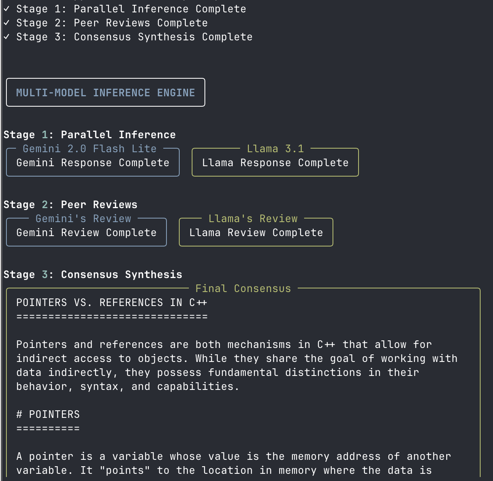

# llm-council

> "A distributed inference engine for hybrid cloud/local consensus."

**llm-council** is a minimalist engine that orchestrates a debate between a cloud model (Gemini) and a local model (Llama 3) to reduce hallucination through adversarial peer review.

 
*(The consensus engine in action: Parallel inference → Peer Review → Final Synthesis)*

## The Philosophy

Most AI agents are "black boxes" that rely on a single provider. This project explores a **Hybrid Architecture** where:
1.  **Speed:** We use `asyncio` to fan-out requests in parallel.
2.  **Privacy:** Critical critique logic runs **locally** (on-device) via Ollama.
3.  **Robustness:** Implements exponential backoff and retry logic for API stability.
4.  **Simplicity:** Zero "AI Framework" bloat. Just pure Python, `httpx`, and `tenacity`.

## Quick Start

### 1. Prerequisites
* **Local Brain:** [Ollama](https://ollama.com) with Llama 3.1 (`ollama run llama3.1`)
* **Cloud Brain:** Google Gemini API Key
* **Python:** 3.10+

### 2. Install
```bash
git clone https://github.com/VS251/llm-council.git
cd llm-council

# Create strict venv
python3 -m venv venv
source venv/bin/activate

# Install dependencies (fastapi, uvicorn, tenacity, rich)
pip install -r requirements.txt
```

### 3. Ignite
```bash
export GEMINI_API_KEY="your_api_key_here"
uvicorn main:app --reload
```

### 4. Query the Engine
Open a new terminal tab and fire a request:
```bash
curl -X POST "[http://127.0.0.1:8000/ask](http://127.0.0.1:8000/ask)" \
     -H "Content-Type: application/json" \
     -d '{"question": "Explain the difference between a pointer and a reference in C++?"}'
```

## Architecture (3-Stage Pipeline)

The `council.py` module implements a directed acyclic graph (DAG) of inference:

- Stage 1: Fan-Out (Parallel)

    - Requests are dispatched to Google Gemini (Cloud) and Llama 3.1 (Local) simultaneously.

    - Latency: Bound by the slowest model (usually Llama on CPU/Metal).

- Stage 2: Adversarial Critique

    - The Skeptic (Local): Llama 3.1 critiques Gemini's answer for logical fallacies.

    - The Optimist (Cloud): Gemini critiques Llama's answer for completeness.

- Stage 3: Consensus Synthesis

    - The "Synthesizer" persona aggregates the original answers and the critiques to generate a final, high-confidence verdict.

## File Structure    

- `main.py`: FastAPI entry point & Rich terminal logging logic.

- `council.py`: Core consensus logic, `tenacity` retry decorators, and model interfacing.

- `requirements.txt`: Minimal dependency tree.

## Meta
* **Generated with:** Windsurf Cascade (Agentic IDE)
* **Terminal:** Ghostty

## License

MIT